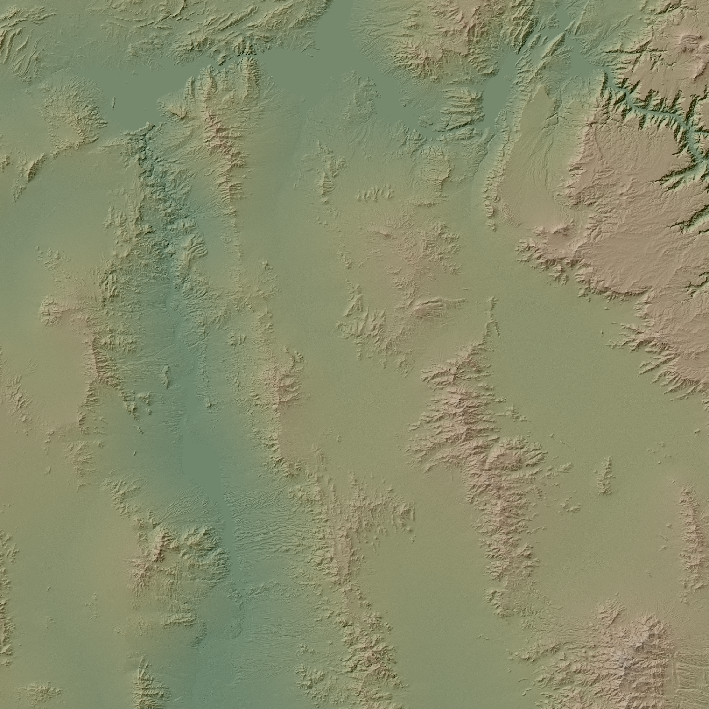
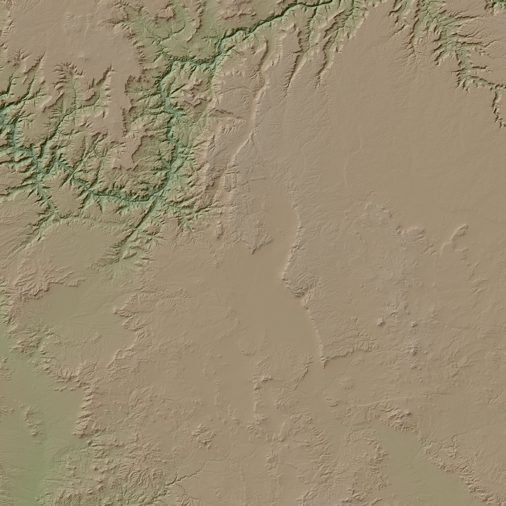
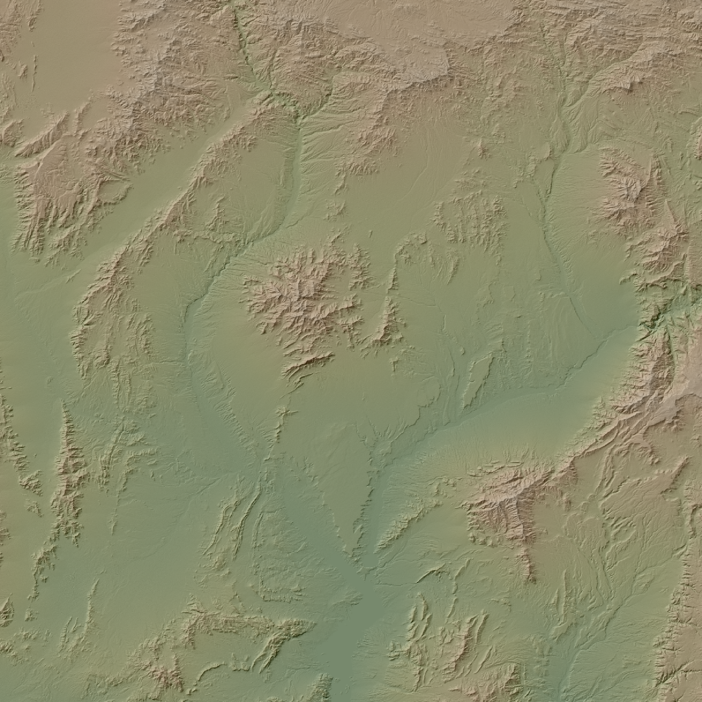
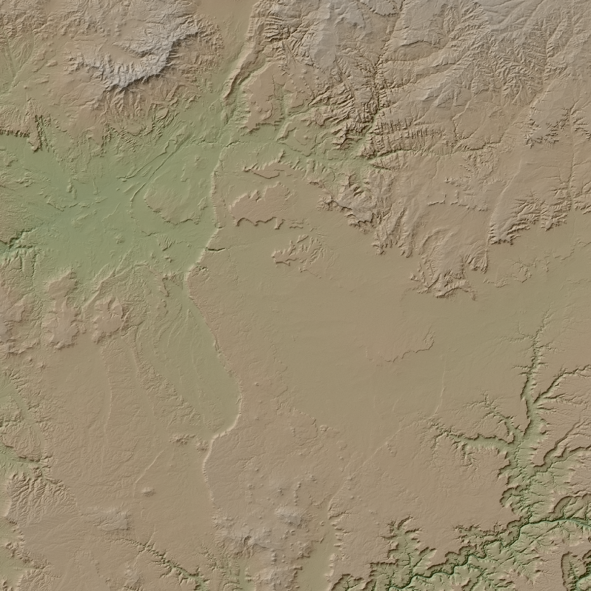

# utiler
A Tiling Utility

Useful for generating Textures/Heightmaps when importing UE4 Landscape Tiles

### Usage 
  
  See
```shell
  python3 utiler.py -h
```

### Demo 

- Orignal Texture 5760x5760


```shell
  python3 utiler.py res/color.png -s 1 -d 2017 -f "res/Tile_{x}_{y}.png" 
```
- Resulting Textures 2017x2017


|              |              |
|------------- |--------------|
| Tile_0_0.png | Tile_1_0.png |
| Tile_1_0.png | Tile_1_1.png |

 

 
  
